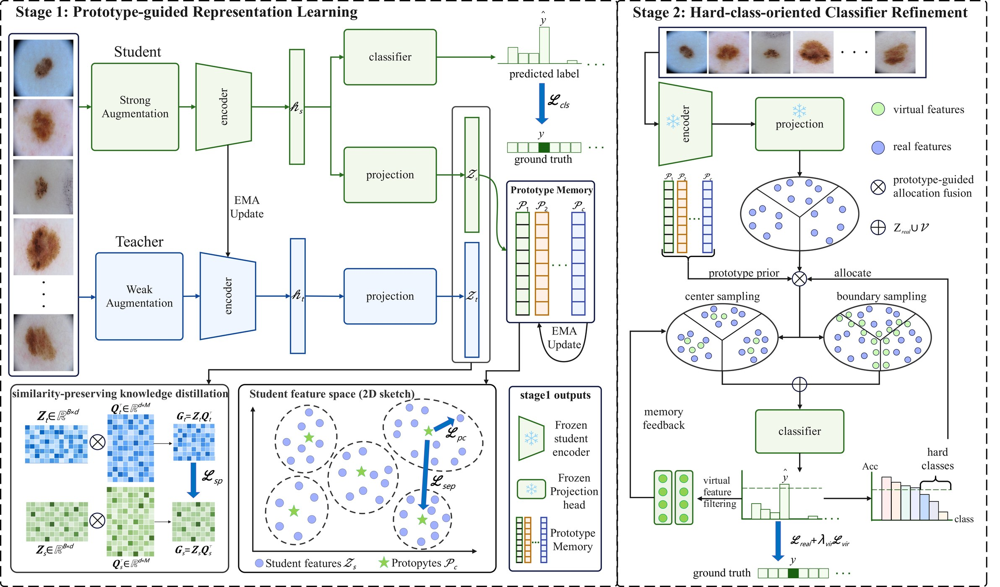

# PSDR

> **From Semantic Consolidation to Decision Refinement: Prototype-Guided Two-Stage Learning for Long-Tailed Skin Lesion Classification**

[](#citation)
[](https://pytorch.org/)
[](#license)

This repository contains the official PyTorch implementation of **PSDR**, a prototype-guided two-stage framework for long-tailed skin lesion classification.

PSDR first consolidates a reliable semantic space with dynamic class prototypes and representation-level constraints. It then freezes the learned representation and refines the classifier with hard-class-oriented center-boundary virtual feature generation.

## News

- **2026-07**: Initial code release prepared for the PSDR paper.
- Paper link and citation will be updated after publication.

## Overview

Long-tailed skin lesion datasets contain severe sample imbalance, high intra-class variation, and subtle inter-class visual differences. PSDR addresses these issues with two stages:

- **Stage 1: Prototype-guided representation learning.** A student-teacher framework maintains dynamic class prototypes and optimizes classification, prototype compactness, similarity-preserving distillation, and prototype separation.
- **Stage 2: Hard-class-oriented classifier refinement.** The encoder and projection head are frozen. Hard classes are selected by real-feature accuracy, and virtual features are generated around class centers and confusion boundaries for targeted classifier refinement.

## Method



## Installation

Create a Python environment and install dependencies:

```bash
pip install -r requirements.txt
```

The recommended backbone in the paper experiments is **MedCLIP-pretrained ViT**. Datasets, pretrained weights, Hugging Face caches, and trained checkpoints are not included in this repository.

Place local MedCLIP assets under `pretrained/medclip-vit/` or set:

```bash
export MEDCLIP_VISION_MODEL_DIR=/path/to/swin-or-medclip-vit-config-dir
export MEDCLIP_WEIGHTS_PATH=/path/to/medclip-vit/pytorch_model.bin
```

The four reproduction scripts source `scripts/common_medclip_env.sh`, which provides default offline-cache environment variables for MedCLIP/Swin execution.

## Data Preparation

The dataset loader expects CSV files with one image-id column followed by one-hot class labels:

```text
image,CLASS_1,CLASS_2,...,CLASS_C
ISIC_0000000,1,0,...,0
ISIC_0000001,0,1,...,0
```

The `image` field should omit the `.jpg` or `.JPG` suffix.

### ISIC-2019-LT

Download ISIC 2019 training images and the ground-truth CSV, then build fixed validation/test splits and long-tailed training splits:

```bash
python prepare_datasets/ISIC2019LT/build_factor_splits.py \
  --data_root /path/to/ISIC_2019_Training_Input \
  --output_root ./split/ISIC2019LT \
  --seed 42 \
  --factors 100,200,500
```

### ISIC Archive

Prepare per-class metadata CSV files and use `prepare_datasets/ISIC_Archive/merge.py` as the split-generation reference. Update the local `root` and `split_root` variables in that script for your machine before running it.

## Training

Only the main reproduction entry points are kept in `scripts/`:

```text
scripts/common_medclip_env.sh
scripts/run_stage1_isic2019lt.sh
scripts/run_stage2_isic2019lt.sh
scripts/run_stage1_isic_archive.sh
scripts/run_stage2_isic_archive.sh
```

### ISIC-2019-LT

Stage 1:

```bash
DATA_ROOT=/path/to/ISIC_2019_Training_Input \
LT_SPLIT_ROOT=/path/to/TPCSD/split/ISIC2019LT \
FACTOR=100 \
CUDA_VISIBLE_DEVICES=0 \
bash scripts/run_stage1_isic2019lt.sh
```

Stage 2:

```bash
DATA_ROOT=/path/to/ISIC_2019_Training_Input \
LT_SPLIT_ROOT=/path/to/TPCSD/split/ISIC2019LT \
FACTOR=100 \
CUDA_VISIBLE_DEVICES=0 \
bash scripts/run_stage2_isic2019lt.sh
```

Set `FACTOR=100`, `200`, or `500` for different imbalance factors.

### ISIC Archive

Stage 1:

```bash
DATA_ROOT=/path/to/ISIC_Archive \
SPLIT_DIR=/path/to/TPCSD/split/ISIC_Archive \
CUDA_VISIBLE_DEVICES=0 \
bash scripts/run_stage1_isic_archive.sh
```

Stage 2:

```bash
DATA_ROOT=/path/to/ISIC_Archive \
SPLIT_DIR=/path/to/TPCSD/split/ISIC_Archive \
CUDA_VISIBLE_DEVICES=0 \
bash scripts/run_stage2_isic_archive.sh
```

## Evaluation and Analysis

The root utilities can be used for custom evaluation and analysis:

```bash
python eval_last_stage1.py --help
python analyze_last_stage2.py --help
python analyze_prototype_alignment.py --help
python visualize_embeddings.py --help
```

## Repository Structure

```text
.
|-- assets/                         # README figures
|-- config/                         # Default hyperparameters and paths
|-- data/                           # Dataset and augmentation code
|-- models/                         # Backbones, projectors, classifiers
|-- prepare_datasets/               # Dataset split preparation scripts
|-- scripts/                        # Main reproduction entry points
|-- utils/                          # Losses, metrics, checkpoint helpers
|-- train_stage1.py                 # Stage 1 training
|-- train_stage2.py                 # Stage 2 classifier refinement
|-- eval_last_stage1.py             # Stage 1 evaluation utility
|-- analyze_last_stage2.py          # Stage 2 analysis utility
|-- analyze_prototype_alignment.py  # Prototype alignment analysis
`-- visualize_embeddings.py         # Feature visualization utility
```

## Outputs

Training outputs are written to:

```text
checkpoints/<run_name>/
log/tpcsd/
```

These outputs are ignored by Git and should be stored separately from the source repository.
